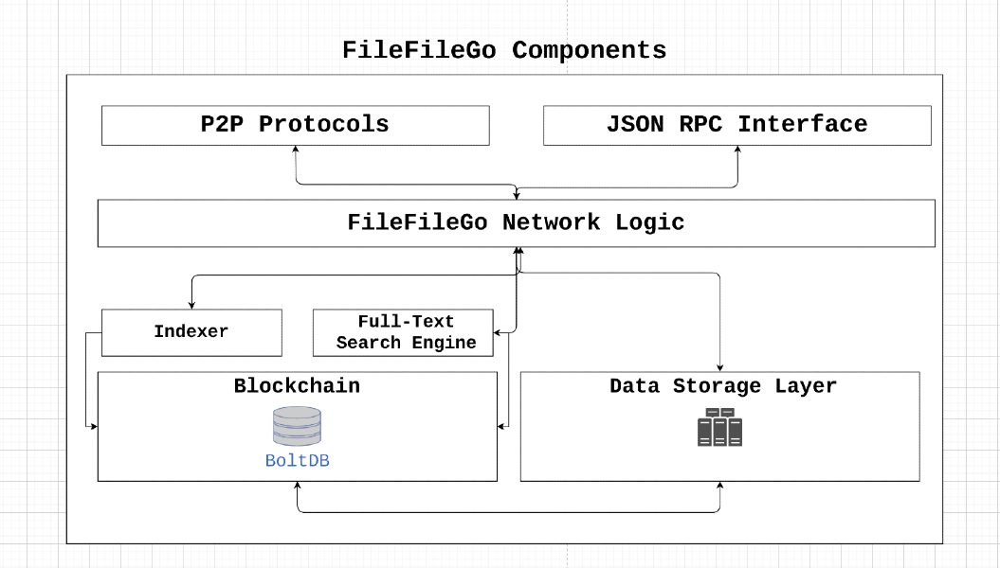

# FileFileGo v1 Decentralized Network

The FileFileGo protocol is a peer-to-peer data-sharing network designed for the web3 era, with an incentive mechanism, full-text search, storage, and indexing/tracking. Its decentralized architecture enables users to share data without censorship or a single point of failure. By leveraging game-theory concepts, FileFileGo incentivizes participation and ensures data availability while achieving fault-tolerance and preserving privacy.

As the internet has grown, it has become increasingly vulnerable to censorship and control by large corporations and ISPs. Governments have also attempted to regulate the flow of information online, making it challenging for informational platforms to operate without interruption. The FileFileGo protocol was developed to address these issues and enable users to access and share information freely.

FileFileGo is an open-source community project, with no centralized control or ownership. Its coin distribution is designed to be fair, with an emission of 40 FFG per block that decreases by half every 24 months. The protocol is launched without ICO/STO/IEO or pre-mine, relying on a Proof of Authority consensus algorithm that will eventually transition to Proof of Stake to allow more stakeholders to participate.

By supporting FileFileGo, users can help promote digital rights, privacy, freedom of information, and net neutrality. We encourage contributions and innovative ideas to ensure that the internet remains an open and decentralized platform.


# The Innovation: Proof of Transfer (PoX) / Proof of Data Possession (PoDP)

## Problem

Let us suppose that `node_1` needs to download some `data_x`, owned by `node_2`, and pay for the fees required by `node_2`. What happens in the case of Byzantine fault nodes? How do we verify successful data transfer to destination nodes and prevent the following malicious cases:
1. `node_1` is a dishonest node that reports `data_x` as invalid, to avoid paying the fees.
2. `node_2` is a dishonest node that serves `data_y` to `node_1` and claims that it's `data_x`.
## Solution


The network can resist Byzantine faults if `node_x` can broadcast (peer-to-peer) a value x, and satisfy the following:

1. If `node_x` is an honest node, then all honest nodes agree on the value x.
2. In any case, all honest nodes agree on the same value y.

The Proof of Transfer mechanism addresses the aforementioned issues by enabling honest nodes in the network to verify and reach consensus on the successful transfer of `data_x` from `node_2` to `node_1`. This is accomplished through the use of verifiers, which are responsible for challenging participating nodes. While a straightforward approach would involve sending the required data to a verifier and then forwarding it to the destination node, this method can lead to bandwidth and storage bottlenecks, thereby reducing the overall network throughput. Therefore, the Proof of Transfer solution has been designed to minimize the bandwidth and storage/memory requirements associated with this process.


```
              ┌───────────┐
     ┌────────►[verifiers]◄─────────┐
     │        └───────────┘         │
┌────┴───┐                     ┌────┴───┐
│        │                     │        │
│ node_1 ◄─────────────────────► node_2 │
│        │                     │        │
└────────┘                     ├────────┤
                               │ data_x │
                               └────────┘

```


#### Merkle Tree

The verification process employed by the verifiers can utilize Merkle Trees as a mechanism for ensuring data integrity, even in cases where they do not have access to the actual data. In this process, participating nodes generate Merkle Trees that are used by the verifiers for comparison and other relevant operations.

```
     ABCD 
    /    \ 
   AB    CD 
  / \    / \ 
 A   B  C   D   
```

*ABCD*  is a merkle root. To prove the validity of *C*, for instance, all that's needed is *D*, so it can be proven that *C|D=CD*, *AB*, so it can be proven that *AB|CD=ABCD*.

#### The Algorithm

In this section, the complete life cycle of a data transfer verification is demonstrated.

1. **Data Discovery:** Numerous wire protocols have been developed to facilitate communication among nodes in a network. Among these protocols, the Data Query protocol is often the first utilized by nodes. This protocol enables nodes to broadcast queries throughout a gossip channel and retrieve responses via direct communication. Essentially, a node sends a request inquiring about which node hosts a particular piece of data.

```
             1. Data Query Request
                    ┌───────┐
    ┌───────────────►[nodes]├───────────────┐
    │               └───────┘               │
┌───┴────┐                             ┌────▼───┐
│        │                             │        │
│ node_1 │                             │ node_2 │
│        │                             │        │
└───▲────┘                             └───┬────┘
    │        2. Data Query Response        │
    └──────────────────────────────────────┘
```

2. **Smart Contract:** The `Data Query Response` payload contains all the information needed to prepare a smart contract transaction. This transaction is then broadcasted to the network which is then selected by a verifier.

```
┌──────────────────────────────────────┐
│              TRANSACTION             │
├──────────────────────────────────────┤
│  Data :                              │
│        - Data query response         │
│        - Remote node signature       │
│  Value:                              │
│        - Fees required by node       │
│                                      │
│  Fees :                              │
│        - Fees collected by verifier  │
│                                      │
│  To   :                              │
│        - Network verifier            │
└──────────────────────────────────────┘

```


3. **Verification:** Verifier(`v1`) communicates with the participating nodes and generates a challenge for the node which hosts the data(`node_2`). The challenge consists of the following steps:
* `node_2` should create a Merkle tree that matches the original Merkle root of `data_x` uploaded in the first place.
* `v1` decides the **order** and the **number of blocks/data** ranges to be sent to `node_1` by `node_2`. We don't want to reveal the order of blocks to `node_1` yet.
* `v1` asks `node_2` for a fixed range of data, which will be encrypted using a random key `k1` as `data_enc` by `v1` and sent to `node_1`.

In this stage, `node_1` possesses some `data_z` and `data_enc` but lacks the knowledge of how to combine them to obtain the original file. The verifier, v1, is able to verify the integrity of the data transmitted to `node_1` and, if they match the original Merkle tree's identity, the decryption key k1 is provided to `node_1`. Additionally, the block order is sent to `node_1`, enabling the reassembly of all the parts to form the original data. Once this process is complete, v1 releases the fees to `node_2`.

The use of this algorithm enables the simultaneous attainment of Proof of Transfer and Proof of Data Possession.
```
            ┌───┬───┬───┬───┬───┬───┬───┬───┐
Data Blocks:│ a │ b │ c │ d │ e │ f │ g │ h │
            └───┴───┴───┴───┴───┴───┴───┴───┘
              0   1   2   3   4   5   6   7
              │   │   │   │   │   │   │   │
              └───┘   └───┘   └───┘   └───┘
               h01     h23     h45     h67
                │       │       │       │
                └───────┘       └───────┘
                h(h01+h23)     h(h45+h67)
                    │               │
                    │               │
                    └───────────────┘
         Merkle root:  h(h(h01+h23)+h(h45+h67))
```


# Installation

Follow the instructions to compile and install filefilego

```
https://filefilego.com/documentation/docs/installation.html#prerequisites
```

Run the full node with search and storage enabled:

```
filefilego --node_identity_passphrase=yournodeidentitypassword --rpc_services="*" --search_engine --storage --storage_dir="~/StorageDirectory/" --storage_token="admintoken" --storage_fees_byte="10000" --addr=0.0.0.0 --http --http_addr=0.0.0.0 --data_downloads_path="~/FFG_Downloads" --bootstrap_nodes="/ip4/18.159.124.250/tcp/10209/p2p/16Uiu2HAmVXbhxA1tiA9PRZJWwSk5jdMfWXbfeGWaubVeT7MZu8ie"
```

The above command runs a full node and starts the http rpc server. In this case, we listen on all interfaces `0.0.0.0` and port `8090` so we can build an application that can interact with this full node.

### CLI Flags

A list of available CLI flags are available below or you can run `./filefilego help`

```
  --config FILE                                        Load configuration from FILE
  --node_identity_passphrase value                     Passphrase to unlock the node identity file
  --log_path_line                                      Logs include file path and line number (default: false)
  --log_level value                                    Logging level
  --data_dir value                                     Data directory to store data/metadata (default: "/home/filefilego/.filefilego_data")
  --keystore_dir value                                 Keystore directory (default: "/home/filefilego/.filefilego_data/keystore")
  --validator                                          Enable Validator (default: false)
  --validator_keypath value                            Path to the key for sealing blocks
  --validator_key_pass value                           Passphrase of keyfile [$FFG_VERIFIER_PASSPHRASE]
  --search_engine                                      Enable full-text indexing (default: false)
  --search_engine_result_count value                   Max number of documents per search query (default: 0)
  --storage                                            Enable storage (default: false)
  --storage_dir value                                  Storage location
  --storage_token value                                Access token for storage engine
  --storage_fees_byte value                            Storage fees per Byte of data
  --storage_file_merkle_tree_total_segments value      File's total segments for merkle tree generation (default: 0)
  --storage_file_segments_encryption_percentage value  File's segments total encryption (default: 0)
  --verify                                             Enable data verification(if verifier in genesis) (default: false)
  --data_verification_fees value                       Data verification fees
  --data_verification_transaction_fees value           Data verification transaction fees for releasing file hoster fees
  --data_downloads_path value                          Directory path for data downloads
  --super_light_node                                   Runs a super light node (default: false)
  --debug                                              Runs a node with debugging (default: false)
  --verify_blocks                                      Verifies all downloaded blocks (default: false)
  --rpc_services value                                 List of rpc services allowed
  --rpc_whitelist value                                Allow IP addresses to access the RPC servers
  --unix_socket                                        Enable IPC-RPC interface (default: false)
  --unix_socket_path value                             Path of the socker/pipe file
  --http                                               Enable the HTTP-RPC server (default: false)
  --http_port value                                    HTTP-RPC server listening port (default: 0)
  --http_addr value                                    HTTP-RPC server listening interface
  --http_origin value                                  HTTP-RPC cross-origin value
  --ws                                                 Enable the WS-RPC server (default: false)
  --ws_port value                                      WS-RPC server listening port (default: 0)
  --ws_addr value                                      WS-RPC server listening interface
  --ws_origin value                                    WS-RPC cross-origin value
  --max_gossip_size value                              Maximum gossip size (default: 0)
  --max_peers value                                    Maximum number of peers to connect (default: 0)
  --port value                                         P2P listening port (default: 0)
  --addr value                                         P2P listening interface
  --min_peers value                                    Minimum number of peers to start periodic bootstraper (default: 0)
  --bootstrap_nodes value                              Bootstraping nodes
  --bootstrap_freq value                               Bootstraping frequency (default: 0)
```

# Architecture

In this section, we cover the disadvantages of different protocols and platforms to get clear picture and examine the weaknesses.

### XDCC

XDCC is a file-sharing method that is based on IRC to serve files.

| **XDCC Disadvantages**                                                                                   |
| -------------------------------------------------------------------------------------------------------- |
| Requires a centralized indexer/tracker/lister which is subject to censorship and single point of failure |
| Transfer protocol rather than a complete file sharing solution                                           |
| No built-in search functionality                                                                         |
| No incentive to retain data                                                                              |

### Usenet

Usenet is a distributed discussion system since 1980.

| **Usenet Disadvantages**                                                                                               |
| ---------------------------------------------------------------------------------------------------------------------- |
| Requires a centralized indexer/tracker/lister which is subject to censorship and single point of failure               |
| Requires subscription and forces user to pay - ( what if only one single file is needed?!)                             |
| Although Usenet providers retain data, it still lacks the incentive mechanism which motivates them to retain even more |

### BitTorrent

BitTorrent is a peer-to-peer file-sharing protocol that requires a client and trackers/DHT.

| **BitTorrent Disadvantages**                                                                              |
| --------------------------------------------------------------------------------------------------------- |
| Requires a centralized indexer/tracker/lister which is subject to censorship and single point of failure  |
| Inactive Torrents without seeders/Lack of incentive mechanism to reward peers for seeding                 |
| IP addresses are completely exposed. Anyone can see what user is downloading and uploading                |
| (Optional) Requires additional VPN and proxy services which are paid services, to solve the above problem |
| Penalty by ISPs for downloading files, usually require users to pay up to USD 200 - USD 5000              |
| Unstable download/upload speed                                                                            |

### Cyberlocker / Filehoster

A cyberlocker is a third-party online service that provides file-storing and file-sharing services.

| **Cyberlocker / Filehoster Disadvantages**                                                               |
| -------------------------------------------------------------------------------------------------------- |
| Requires a centralized indexer/tracker/lister which is subject to censorship and single point of failure |
| The Filehoster on its own is subject to censorship. (e.g megaupload was shut down by DOJ)                |
| Requires subscription and premium upgrades - ( what if only one single file is needed?!)                 |
| Extremely slow speeds which force users to pay for premium account                                       |
| Inactive files are deleted after a few months / Lack of incentive mechanism                              |

## FileFileGo Components



### Features

FileFileGo is a decentralized network that incorporates the robustness of Usenet, Blockchain/Cryptocurrency, DHT, and BitTorrent's innovative technology to form an unassailable infrastructure that cannot be censored or taken down by Internet Service Providers (ISPs).

- The platform employs Blockchain technology for indexing, tracking, and other network metadata and logic, ensuring a secure and efficient system. 
- Encrypted traffic protects user data from third-party traffic inspection, while a privacy-centric design relays traffic through a set of intermediate peers. 
- The peer-to-peer design replicates the network's state on each full node, enhancing data reliability.
- The network's native cryptocurrency serves as the "fuel" and guarantees an extremely low and conditional transaction fee compared to Ethereum/Bitcoin. 
- With a dynamic block size and block-time of 10 seconds, FileFileGo ensures quick and seamless transactions.
- FileFileGo also offers an RPC interface that allows developers to build DApps on the network.

### Blockchain Consensus Algorithm

To achieve a block-time of 10 seconds, FileFileGo requires a consensus algorithm that is both efficient in processing a high volume of transactions and conserves processing power. For the initial phase, we have selected Proof of Authority (PoA) as our consensus algorithm. In the future, a Proof of Stake (PoS) mechanism will replace the current algorithm.

Using PoW-based algorithms for new blockchains poses a risk, as there are already substantial pools of computing power available that could be used for 51% attacks. Therefore, we have opted for PoA, which is safe by design and provides the necessary efficiency to support our high transaction volume requirements.

#### Proof of Authority / Validator+Verifier Algorithms

The identities of validators are hardcoded into the blockchain and can be verified by examining the Genesis block's coinbase transaction. Participating nodes can easily verify the authenticity of these identities by checking the block's signatures.

#### Proof of Stake

As we move forward, the current PoA mechanism will be replaced by proof-of-stake to enable multiple parties to participate in the block mining process. Our goal for blockchain governance is to encourage more parties and developers to become involved and increase stakeholder engagement. One of the incentives for achieving this goal is the Proof-of-Stake mechanism.

### Blockchain and Metadata/Accounting

To simplify transaction and state mutation, FileFileGo adopts a different approach than UTXO-like structures. Rather than using such structures, we store accounting and metadata as regular database rows, while retaining the raw blocks in their original format within the database. This approach helps to eliminate unnecessary complexity.

# Technical Details

In this section, we will provide an overview of technical terms and concepts used in FileFileGo.

### Channels


Channels in FileFileGo enable users to organize and group data into distinct buckets or folders. For instance, all content on ubuntu.com could be placed in a channel named "Ubuntu Official." The user who creates a channel receives all permissions necessary for updates and other channel-related operations.

Channels are structured in a node-chain format and can be identified as a node without a `ParentHash`.

### Sub Channel

The concept of a sub-channel is to be able to categorize data even further. For instance, documents, pictures, or music.

### Entry & File/Directory

In filefilego an `Entry` represents a post or a piece of data that contains more information about the entry itself rather than categorization/ordering. `File` and `Directory` can be placed into an `Entry`.

### Data Storage Layer

`Storage Engine` is the storage layer that tracks binary data, which are used by hash pointers within the blockchain to refer to a piece of data. The `NodeItem` structure has a field called `FileHash` which refers to the binary hash and is in the form of `"{HASH_ALGORITHM}:>{DATA_HASH}"`. We would like to keep the metadata of the hashing algorithm used as it might be useful in the future.

### Full-text Index/Search

In FileFileGo, search accuracy and flexibility are equally important as the core blockchain functionality. We aim to enable users to construct complex queries, including binary searches, using a specific query language. For example, queries of the following types should be possible:

1. Required or inclusive ("filefilego coin"), which means both "filefilego" and "coin" are required in the search results.
2. Optional or exclusive ("filefilego currency"), which means one of those words can be excluded from the search results.

Developing a query language that supports such complex queries is a powerful tool that can significantly enhance the search engine's accuracy.

It is also possible to enable a node's full-text indexing functionality using the `--search` CLI flag.
### Storage Engine

The storage layer keeps track of binary files and uses hashes to represent a piece of information within the blockchain. This feature can be turned on by using the following flags:

```
... --storage --storage_dir="/somewhere/to/store/data" --storage_token="somelongtokenhere" --storage_fees_byte="10000" ...
```

`--storage_dir` should be a directory that exists with appropriate read/write permissions. Please note that full nodes can work without this mechanism. `storage_token` is a token that grants admin rights to a token so it can create other tokens using the HTTP API. This is useful when access right is needed by web apps or distinct users and `--storage_fees_byte="10000"` is the fees charged per byte of data.

# Coin Distribution

### The Coin

| Unit                     | Value                  |
| ------------------------ | --------------------------------- |
| **FFGOne**               | **1**                             |
| **KFFG**                 | **1.000**                         |
| **MFFG**                 | **1.000.000**                     |
| **GFFG**                 | **1.000.000.000**                 |
| **MicroFFG**             | **1.000.000.000.000**             |
| **MiliFFG**              | **1.000.000.000.000.000**         |
| **FFG** (Default unit)   | **1.000.000.000.000.000.000**     |
| **ZFFG**                 | **1.000.000.000.000.000.000.000** |

**Total Supply:** 500 Million FFG
**Validation/Stake Reward:** 40 FFG per Block
**Supply Decrease Rate:** Divide by 2 every 24 months
